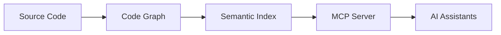

# CodePrysm

[](https://crates.io/crates/codeprysm-cli)
[](https://github.com/codeprysm/codeprysm/actions/workflows/rust.yml)
[](https://opensource.org/licenses/MIT)

A powerful tool for analyzing code repositories and generating relationship graphs using Tree-sitter abstract syntax trees. CodePrysm transforms source code into a searchable knowledge graph, enabling semantic code search, dependency analysis, and intelligent code navigation.

## Overview

CodePrysm builds a comprehensive graph representation of your codebase where:
- **Nodes** represent code entities using three semantic types: Container (classes, interfaces, structs), Callable (functions, methods), and Data (fields, properties, constants)
- **Edges** represent three types of relationships: CONTAINS (hierarchy), USES (dependencies), and DEFINES (definitions)
- **Embeddings** enable semantic search using natural language with full metadata support

### Key Features

- **Semantic Code Search** - Find code using natural language queries with kind/subtype filtering
- **AST-Based Analysis** - Precise parsing using Tree-sitter with declarative SCM tags
- **Rich Dependency Graphs** - Three relationship types (CONTAINS, USES, DEFINES) for comprehensive analysis
- **Fine-Grained Entities** - Distinguish structs from interfaces, async from sync, fields from properties
- **Scalable Architecture** - Handles codebases with 100K+ files
- **MCP Integration** - AI-powered code exploration via Model Context Protocol
- **Multi-Language** - Python, JavaScript/TypeScript, C/C++, C#, Go, Rust
- **GPU Acceleration** - Metal (macOS) and CUDA (Linux/Windows) support

## Installation

### From crates.io (Recommended)

```bash
cargo install codeprysm-cli
```

### From Source

```bash
git clone https://github.com/codeprysm/codeprysm.git
cd codeprysm
cargo build --release
```

### GPU Acceleration (Optional)

For faster embedding generation, install with GPU support:

```bash
# macOS (Apple Silicon)
cargo install codeprysm-cli --features metal

# Linux (NVIDIA GPU)
cargo install codeprysm-cli --features cuda
```

### Prerequisites

- Docker (for Qdrant vector database)
- Rust 1.85+ (only if building from source)
- Internet connection (for first-time model download)

> **Note**: Embedding models (~500MB) are automatically downloaded from HuggingFace Hub to `~/.cache/huggingface/hub/` on first use. This is a one-time download.

## Quick Start

1. **Start Qdrant** (required for semantic search):
   ```bash
   docker run -d --name qdrant \
     -p 6333:6333 -p 6334:6334 \
     -v qdrant_storage:/qdrant/storage \
     qdrant/qdrant:latest
   ```

2. **Initialize your codebase:**
   ```bash
   cd /path/to/your/repo
   codeprysm init
   ```

3. **Start the MCP server** (optional, for AI assistants):
   ```bash
   codeprysm mcp
   ```

## How It Works



The system operates in three main phases:

1. **Code Graph Generation** - Parse source files into a graph structure using Tree-sitter AST
2. **Indexing for Search** - Create embeddings for semantic search using Qdrant
3. **MCP Server Integration** - Expose capabilities to AI assistants via MCP protocol

## Documentation

- [Getting Started](docs/getting-started.md) - Setup guide
- [Docker Setup](docs/getting-started-docker.md) - Running with Docker
- [SCM Tag Convention](docs/development/scm-tag-naming-convention.md) - Query file syntax
- [SCM Overlays](docs/guides/scm-overlays.md) - Adding scope metadata

## CLI Commands

```bash
# Generate code graph
codeprysm init --root /path/to/repo

# Start MCP server
codeprysm mcp --root /path/to/repo --qdrant-url http://localhost:6334

# Search codebase
codeprysm search "function that handles authentication"

# Show statistics
codeprysm stats --codeprysm-dir .codeprysm

# Incremental update
codeprysm update --root /path/to/repo
```

## Supported Languages

| Language | Containers | Callables | Data |
|----------|------------|-----------|------|
| Python | Classes, modules | Functions, methods, async | Fields, constants |
| JavaScript/TypeScript | Classes, interfaces, enums | Functions, methods, constructors | Fields, properties |
| C/C++ | Structs, classes, enums, namespaces | Functions, methods | Fields, enum constants |
| C# | Classes, structs, interfaces, enums | Methods, constructors | Fields, properties |
| Go | Structs, interfaces | Functions, methods | Fields |
| Rust | Structs, enums, traits | Functions, methods, async | Fields, const values |

## Performance & Scalability

| Codebase Size | Files | Processing Time | Memory Usage |
|---------------|-------|-----------------|--------------|
| Small | <1K | <1 min | <1 GB |
| Medium | 1K-10K | 1-5 min | 1-4 GB |
| Large | 10K-50K | 5-20 min | 4-16 GB |
| Very Large | 50K-100K | 20-60 min | 16-32 GB |

## Development

For development, install [just](https://github.com/casey/just) command runner:

```bash
# Build
just rust-build

# Test
just rust-test

# Lint
just rust-lint

# Format
just rust-fmt
```

See [CONTRIBUTING.md](CONTRIBUTING.md) for detailed development guidelines.

## Project Structure

```
codeprysm/
├── crates/
│   ├── codeprysm-core/     # Graph generation, tree-sitter parsing
│   ├── codeprysm-search/   # Vector search, embeddings
│   ├── codeprysm-mcp/      # MCP server
│   ├── codeprysm-cli/      # Command-line interface
│   ├── codeprysm-config/   # Configuration management
│   └── codeprysm-backend/  # Backend abstraction
├── tests/fixtures/         # Test repositories
├── docs/                   # Documentation
└── docker/                 # Docker configuration
```

## Contributing

Contributions are welcome! Please see [CONTRIBUTING.md](CONTRIBUTING.md) for guidelines.

## License

This project is licensed under the MIT License - see the [LICENSE](LICENSE) file for details.

## Acknowledgments

- [Tree-sitter](https://tree-sitter.github.io/tree-sitter/) for powerful parsing capabilities
- [Qdrant](https://qdrant.tech/) for vector search
- [Candle](https://github.com/huggingface/candle) for ML inference
